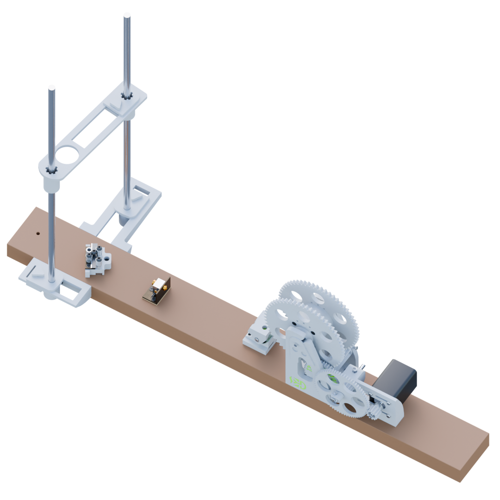

PET Filament Maker adalah perangkat yang dirancang untuk mengubah botol PET bekas menjadi filament 3D yang dapat digunakan kembali. Proyek ini bertujuan memberikan solusi yang ramah lingkungan, mengurangi limbah plastik sekaligus menghemat biaya material filament yang biasanya harus dibeli.

Proses Kerja:
1. Persiapan Bahan: Botol PET bekas dibersihkan terlebih dahulu untuk menghilangkan label dan kotoran agar siap diproses.
2. Pelurusan Permukaan Botol: Botol PET yang memiliki permukaan tidak rata perlu diluruskan dengan memanaskan permukaannya sambil memutar botol menggunakan blower, heatgun atau di atas kompor. Proses pemanasan ini mengurangi lekukan, memungkinkan permukaan botol menjadi lebih rata dan mudah dipotong.
3. Ekstrusi: Botol PET dipotong menjadi strip dan dipanaskan hingga lunak untuk diubah menjadi bentuk filament, kemudian ditarik secara otomatis agar ukuran filament konsisten.
4. Pemeriksaan Kualitas Filament: Filament yang dihasilkan diperiksa untuk memastikan kualitas dan ketebalan sesuai spesifikasi.

Kesimpulan:
Filament Maker dari botol PET bekas ini memberikan solusi ekonomis sekaligus ramah lingkungan, memungkinkan pengguna mendaur ulang plastik bekas menjadi filament yang siap digunakan dalam pencetakan 3D. Dengan desain yang mudah dioperasikan, kontrol otomatis yang presisi, dan sistem modular yang mempermudah perawatan, proyek ini menawarkan pendekatan baru yang berkelanjutan dalam produksi material 3D.

Dokumentasi Bahasa Indonesia : https://docs.google.com/document/d/12gZyxp6K4KovrQUbeszD_oszRoTwFk6smVtTxPSdtus/edit?usp=sharing

BOM : https://docs.google.com/spreadsheets/d/1hQpWlGkNJCp8BHFFs-p2dSdpw58OgJwYKI5ZXl5ccxk/edit?usp=sharing

Lisensi : Silahkan lihat file LICENSE
